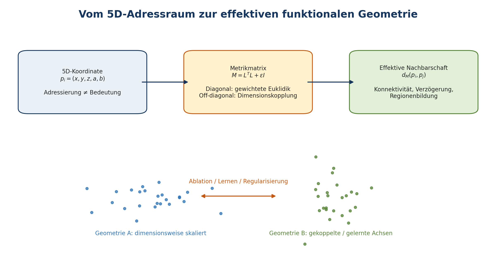

[Inhaltsuebersicht](README.md) | [Zurueck](section-018.md) | [Weiter](section-020.md)

# 15. Fünfdimensionaler Adressraum und dynamischer Graph

## Zwei verschiedene Bedeutungen von fünf Dimensionen

Der philosophische Vektor I = (M, E, G, Z, X) ordnet Beschreibungsaspekte von Intelligenz. Die neuronalen Koordinaten p = (x, y, z, a, b) definieren dagegen einen technischen Adress- und Beziehungsraum. Beide Modelle verwenden fünf Komponenten, besitzen aber verschiedene Objekte, Skalen und Beweislasten. Die Uebereinstimmung ihrer Anzahl liefert keinen empirischen Zusammenhang. Eine Überlegenheit der neuronalen 5D-Geometrie muss durch die folgenden kontrollierten Ablationen geprüft werden. \[K1; K3; eigene begriffliche Klärung\]

## Der fünfdimensionale Raum

### Adressraum und Materialisierung

**\[DEF\]** Eine potenzielle Neuronenadresse ist

$$p_{i} = \left( x_{i},y_{i},z_{i},a_{i},b_{i} \right) \in A_{5}.$$Für einen diskreten Hyperkubus mit Kantenlänge $L$ gilt

$$\left| A_{5} \right| = L^{5}.$$Bei $L = 50$ ergeben sich $312.500.000$ mögliche Adressen. Dies ist eine Kapazität des Adressraums, nicht die Verpflichtung, ebenso viele Python-Objekte oder physische Neuronen gleichzeitig anzulegen.

**\[DEF\]** Die materialisierte Menge zum Zeitpunkt $t$ lautet

$$N_{t} \subseteq A_{5},\left| N_{t} \right| \ll \left| A_{5} \right|$$für sparse Simulationen. Eine Adresse ist nicht automatisch belegt; eine belegte Adresse ist nicht automatisch aktiv.

### Semantik der Dimensionen

Die Basishypothese verwendet $(x,y,z)$ als räumlich-topologische Achsen und $(a,b)$ als zusätzliche funktionale Achsen. Diese Semantik ist **nicht** als unveränderliche Naturbeschreibung zu verstehen. Mindestens vier Varianten sind experimentell zulässig:

1.  **fixed semantic axes:** $a$ und $b$ repräsentieren vorab definierte Modalität oder Verarbeitungsebene;

2.  **developmental axes:** Koordinaten verändern sich nur in definierten Entwicklungsphasen;

3.  **learned metric:** Koordinaten bleiben fest, aber ihre effektive Metrik wird gelernt;

4.  **learned embedding:** auch Positionen oder Regionen werden unter Nebenbedingungen angepasst.

Die Varianten sind verschiedene Modelle und dürfen in Ergebnissen nicht vermischt werden.

### Allgemeine Metrik

**\[DEF\]** Für $\delta_{ij} = p_{i} - p_{j}$ wird eine Mahalanobis-artige Distanz definiert:

$$d_{M}\left( p_{i},p_{j} \right) = \sqrt{\delta_{ij}^{\top}M\delta_{ij}}.$$Ist $M \in R^{5 \times 5}$ symmetrisch positiv definit, ist $d_{M}$ eine Metrik. Bei positiver Semidefinitheit kann für verschiedene Punkte Distanz null auftreten; es handelt sich dann im Allgemeinen um eine Pseudometrik. Der bisherige Ausdruck

$$d_{ij} = \sqrt{\lambda_{x}\Delta x^{2} + \lambda_{y}\Delta y^{2} + \lambda_{z}\Delta z^{2} + \lambda_{a}\Delta a^{2} + \lambda_{b}\Delta b^{2}}$$ist der Spezialfall

$$M = diag\left( \lambda_{x},\lambda_{y},\lambda_{z},\lambda_{a},\lambda_{b} \right).$$Off-diagonale Elemente modellieren Dimensionskopplungen. Ein positiver Eintrag $M_{ab}$ bedeutet nicht unmittelbar eine semantische Beziehung; er verändert zunächst die Geometrie der Distanzberechnung.

### Lernbare Metrik

Um Positivdefinitheit zu erhalten, kann die Metrik parametrisiert werden als

**\[MODEL\]**

$$M = L^{\top}L + \varepsilon I,\varepsilon > 0.$$Eine lernbare Metrik benötigt Regularisierung, weil triviale Lösungen möglich sind. $M \rightarrow 0$ kollabiert alle Distanzen; unbeschränkt große Eigenwerte können Nachbarschaften zerstören. Kandidaten sind:

$$L_{metric} = L_{task} + \alpha tr(M) + \beta \parallel M - I \parallel_{F}^{2} - \gamma\log\det(M).$$**\[MODEL\]** Die genaue Form ist eine Arbeitsfamilie, keine festgelegte Theorie. Sie muss gegenüber diagonalem $M$, zufälligem $M$, identischer Matrix und dimensionsreduzierten Kontrollen getestet werden. Metriklernen ist in der maschinellen Lernliteratur etabliert; Brain-5D überträgt die Idee auf eine dynamische neuronale Topologie ([Weinberger & Saul, 2009](section-045.md#ref-Weinberger2009)).

Abbildung 6. Konzeptioneller Übergang vom 5D-Adressraum zu einer effektiven, gegebenenfalls gelernten funktionalen Geometrie.

### Adressraum oder funktionale Geometrie?

Die zentrale Geometriefrage lautet:

> **Ist 5D nur eine effiziente Adressierung, oder bildet beziehungsweise lernt das Netzwerk eine Geometrie, deren Nachbarschaften funktionale Vorhersagekraft besitzen?**

Eine funktionale Geometrie wäre nur dann belegt, wenn Distanz oder geodätische Nähe über reine Koordinatenkonvention hinaus mit Konnektivität, Verzögerung, Kodierung, Transfer oder Läsionseffekten zusammenhängt und gegenüber Nullmodellen zusätzliche Erklärungskraft besitzt.

### Normierung und Einheiten

Sind Koordinatenachsen unterschiedlich skaliert, kann die Metrik allein wegen der Einheiten verzerrt werden. Vor Vergleichsversuchen sind daher Achsenbereiche, Randbedingungen und Normalisierung festzulegen. Mögliche Randbedingungen sind offen, reflektierend oder toroidal. Eine toroidale Distanz kann Randartefakte reduzieren, verändert jedoch die Topologie und muss als eigene Bedingung behandelt werden.

### Dimensionsablation

**\[HYP \| CLAIM-GEO-001\]** Fünf Dimensionen können bei gleicher Neuronen- und Synapsenzahl eine günstigere Trennung funktionaler Nachbarschaften ermöglichen. Die Nullhypothese lautet, dass 5D gegenüber geeigneten Kontrollen keinen Vorteil besitzt.

Verglichen werden mindestens $D \in \{ 2,3,4,5,6\}$ sowie:

- ein Erdos-Renyi-artiges Sparse-Netz mit gematchtem Grad;

- ein gradverteilungserhaltend rewired Netzwerk;

- ein nichtgeometrisches Reservoir;

- ein 5D-Netz mit permutierten Koordinaten;

- ein 5D-Netz mit identischer Topologie, aber deaktivierter Distanzverwendung.

Gematcht werden soweit möglich Neuronenzahl, Synapsenzahl, Gradverteilung, Verzögerungsbudget, Gesamtgewicht, Eingangsenergie, Lernregeln und Simulationszeit. Ohne diese Kontrollen wäre ein Vorteil von 5D möglicherweise nur ein Vorteil höherer Konnektivität oder größerer Ressourcen.

## Dynamischer Graph und Graphentheorie

### Formale Graphdefinition

**\[DEF\]** Der materialisierte Netzwerkgraph zum Zeitpunkt $t$ ist

$$G_{t} = \left( V_{t},E_{t},W_{t},D_{t},T_{t},R_{t} \right),$$mit Knoten $V_{t}$, gerichteten Kanten $E_{t}$, Gewichten $W_{t}$, Verzögerungen $D_{t}$, Synapsentypen $T_{t}$ und Ressourcen-/Provenienzattributen $R_{t}$. Da Knoten und Kanten entstehen oder verschwinden können, ist $G_{t}$ ein dynamischer, gewichteter, gerichteter, typisierter und räumlich eingebetteter Graph.

### Verbindungswahrscheinlichkeit

Eine allgemeine Modellfamilie lautet:

**\[MODEL\]**

$$P_{t}(i \rightarrow j) = \sigma\left( \beta_{0} - \beta_{d}d_{M}\left( p_{i},p_{j} \right) + \beta_{c}C_{ij}(t) + \beta_{h}H_{ij}(t) + \beta_{r}R_{ij}(t) \right),$$wobei $\sigma$ eine begrenzende Linkfunktion ist, $C_{ij}$ Aktivitätskopplung, $H_{ij}$ Homophilie beziehungsweise Typkompatibilität und $R_{ij}$ Ressourcen- oder Entwicklungsbedingungen ausdrückt. Die einfache Exponentialform

$$P(i \rightarrow j) = P_{0}e^{- \frac{d_{M}}{\sigma_{d}}}$$ist ein Spezialfall. Die Verwendung einer Wahrscheinlichkeit bedeutet nicht, dass Verbindungen bei jedem Tick neu gezogen werden; Erzeugungszeitpunkt und Persistence-Regeln sind Teil der Strukturplastizität.

### Messgrößen

Für Brain-5D sind mindestens folgende Graphmaße relevant ([Newman, 2010](section-045.md#ref-Newman2010); [Rubinov & Sporns, 2010](section-045.md#ref-Rubinov2010)):

- In-/Out-Degree und gewichtete Strength-Verteilungen;

- lokale und globale Clustering-Koeffizienten;

- kürzeste Pfade beziehungsweise verzögerungsgewichtete Pfade;

- globale und lokale Effizienz;

- Assortativität nach Zelltyp, Alter, Region und Aktivität;

- Modularität und Community-Stabilität;

- Motif-Häufigkeiten und Feedforward-/Feedback-Strukturen;

- spektrale Größen des Adjazenz- und Laplaceoperators;

- räumliche Kantenlängen, Wiring Cost und Delay-Verteilung;

- zeitliche Persistenz und Turnover von Knoten und Kanten.

Graphmetriken sind stark voneinander und von Dichte abhängig. Ihre Interpretation erfordert deshalb Nullmodelle, Dichtekontrolle und Unsicherheitsintervalle.

### Nullmodelle

Ein Nullmodell soll die zu prüfende Eigenschaft zerstören, ohne irrelevante Größen zu verändern. Beispiele:

1.  degree-preserving edge swaps ([Maslov & Sneppen, 2002](section-045.md#ref-Maslov2002));

2.  Gewichtsshuffle bei fester Topologie;

3.  Koordinatenpermutation bei festen Kanten;

4.  zeitliche Spike-Shuffles unter Erhalt individueller Raten;

5.  Regionenlabel-Shuffles;

6.  geometrische Zufallsgraphen mit gematchter Dichte ([Penrose, 2003](section-045.md#ref-Penrose2003));

7.  Delay-Shuffles bei identischer Gewichtsstruktur.

Ein Vergleich mit nur einem zufälligen Graphen ist selten ausreichend. Besonders Community Detection besitzt Auflösungs- und Degenerationsprobleme; Resultate sollten über Algorithmen, Parameter und Seeds geprüft werden ([Fortunato, 2010](section-045.md#ref-Fortunato2010)).

### Spektrale Perspektive

Eigenwerte von Adjazenz-, Laplace- oder linearisierter Dynamikmatrix können Hinweise auf Konnektivität, Diffusion und lokale Stabilität liefern ([Chung, 1997](section-045.md#ref-Chung1997)). Sie ersetzen jedoch keine vollständige Analyse eines nichtlinearen Reset-Systems. Wird eine spektrale Größe als Prädiktor verwendet, ist zu zeigen, dass sie über triviale Größen wie Dichte und mittleres Gewicht hinaus erklärt.

### Graphgeodäten und Umgebungsdistanz

Brain-5D unterscheidet:

$d_M(p_i,p_j)$ (Umgebungs- oder Metrikdistanz)

von

$d_G(i,j)$ (kürzeste oder kostenminimale Pfaddistanz im Graphen).

Eine kleine Umgebungsdistanz garantiert keine Verbindung, und eine kurze Graphgeodäte kann weit entfernte Koordinaten durch Langstreckenkanten koppeln. Die Differenz zwischen beiden ist selbst eine messbare Systemeigenschaft.

[Inhaltsuebersicht](README.md) | [Zurueck](section-018.md) | [Weiter](section-020.md)
